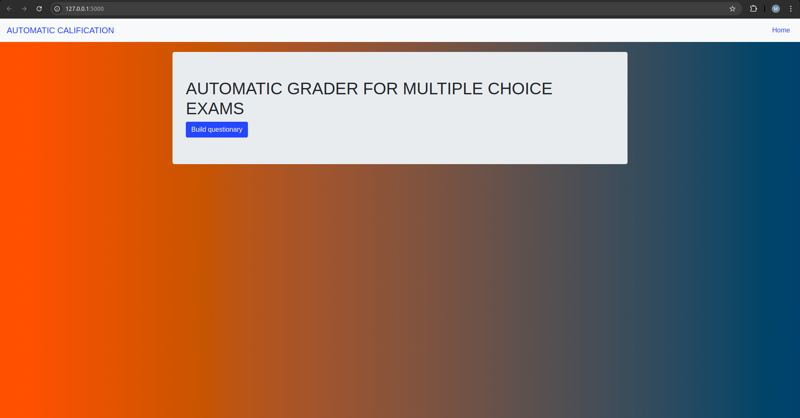

# Automatic grader test

En este documento encontrará la documentación necesaria para calificar automáticamente exámenes de selección múltiple, tenga en cuenta que la calificación se hace a través de imágenes capturadas por cámaras o celulares, facilitando la rápida recolección y asimismo la obtención de los resultados.

# Características de la prueba
En la versión actual se puede calificar correctamente exámenes de selección múltiple con hasta 7 preguntas y cinco opciones de respuesta (A, B, C, D, E),
también se debe considerar que el estudiante escribe la letra en mayúscula en la sección de respuestas, es decir, la primera fila de la tabla corresponde
al número de la pregunta y la segunda fila a la respuesta, por ejemplo, para la primera pregunta el estudiante puede escribir la letra "B" si él piensa 
que es la respuesta correcta, debe realizar el mismo proceso para todas las preguntas.

# Imagen de prueba 
En la siguiente imagen se muestra cómo el estudiante debe diligenciar el formulario, en donde, la respuesta a la primera pregunta es la letra "B", para la segunda es "D", y de esta forma puede ir avanzando hasta terminar la prueba. 

# Inicio de la aplicación 
Al tener listos los exámenes se procede a inicializar el aplicativo, en el que se abre una página web utilizando el servidor local del computador, en este punto se debe seleccionar "Build questionary", el cual, llevará a una nueva pestañana en la que se podrá construir el calificador.

# Construcción del calificador 
Se muestran dos opciones, número de preguntas y de opciones, el primero hace referencia a la cantidad de preguntas con la que cuenta el examen y la segunda qué opciones serán válidas, es decir, si solo se espera recibir las letras "A", "B", "C", se debe escribir el número tres. Recuerde hacer click sobre el botón Submit para que el examen se guarde satisfactoriamente

# Selección de respuestas correctas 
Se debe agregar la respuesta correcta a cada pregunta, de esta forma el aplicativo podrá realizar las calificaciones exitosamente, tenga en cuenta que debe oprimir el botón submit para que las respuestas se guarden

A partir de este punto se disponen de diferentes opciones, siendo la primera la descarga de un formato con el que se puede aplicar la prueba, es decir, se crea una tabla de preguntas y respuestas, en un archivo de excel que puede utilizarse para realizar las pruebas, por otra parte, se muestra la opción de realizar una calificación individual o grupal.

# Calificación individual 
En este punto se abre una nueva pestaña, en la que se debe cargar el respectivo examen a calificar. Tenga en cuenta que la imagen debe estar en formato ".png"

Una vez cargada la imagen se oprime el botón upload, esto redirige a una nueva pestaña en la que se muestra la calificación y las respuestas correctas e incorrectas del estudiante 

# Calificación Grupal 
Para realizar una calificación grupal se puede tener cualquier cantidad de imágenes, sin embargo, se debe considerar que el procesamiento de éstas se hace desde el computo local, planteando que un gran número de imágenes generará un gran consumero de recursos de computacionales, por ello, el modelo se planteó utilizando tarjetas gráficas y con las configuraciones necesarias para que CUDA pueda correr el aplicativo desde la GPU si es posible.

Se debe considerar que las imágenes deben estar en una carpeta, la cual, debe estar comprimida en formato .zip

Una vez calificadas las imágenes se mostrará una nueva página en la que se podrá visualizar diferentes estadísticos descriptivos, como la media, mediana, desviación estándar, varianza, puntaje máximo y mínimo, estudiantes aprobados y reprobados.

Además, se muestra un gráfico de barras en el que se puede visualizar la calificación de cada estudiante, donde las barras verden pertenencen a los aprobados y lor rojos son a los reprobados.

Se tiene otro gráfico de barras en el que se muestra la frecuencia de cada calificación

Ahora se muestra un gráfico de pastel, en el que se puede evidenciar las calificaciones con mayor frecuencia 

